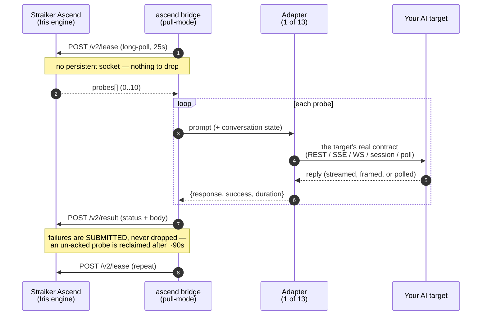
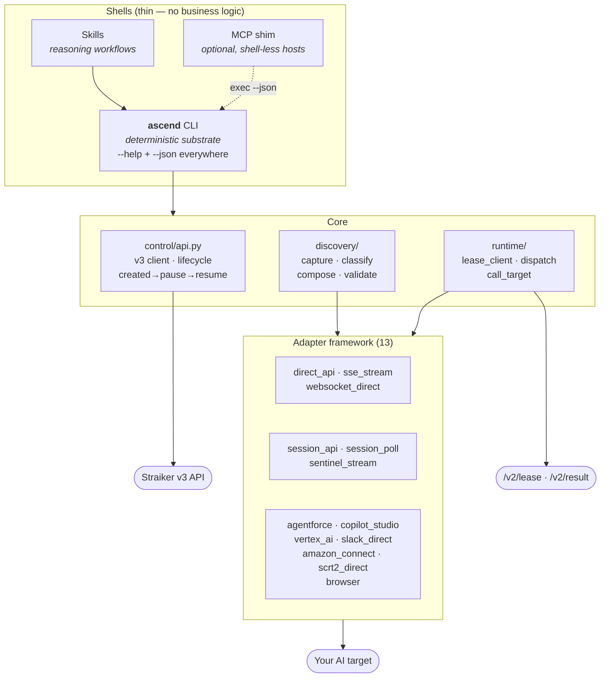
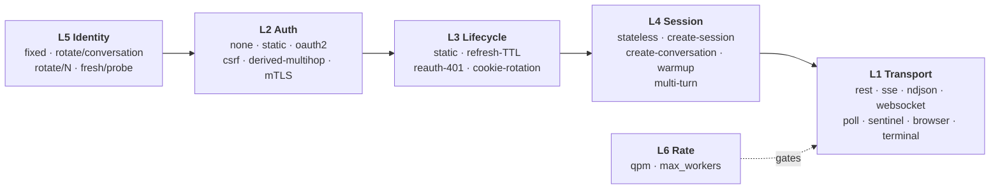
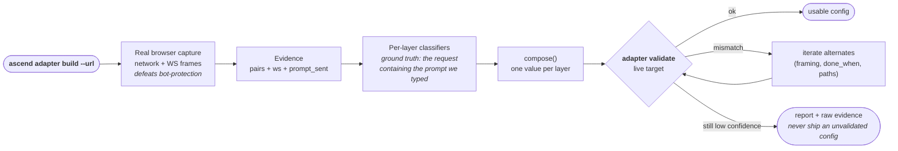

# Ascend CLI

A Python 3 red-team toolkit that connects the **Straiker Ascend** assessment cloud to
any AI target: REST APIs, streaming (SSE) endpoints, WebSocket chat, multi-step session
APIs, browser-only widgets, and platform bots (Salesforce, Slack, Vertex AI, Copilot
Studio, Amazon Connect). It registers the target as an Ascend application, runs a red-team
assessment against it, and monitors the result, all from one scriptable CLI.

Ascend CLI **replaces the legacy WebSocket bridge** with a *pull-mode* runtime. The
old bridge held a persistent socket that Ascend pushed probes onto; a dropped connection
produced bad-handshake errors and could auto-pause a live assessment. v2 inverts the flow:
the runtime *leases* probes over plain HTTP, calls your target through an adapter, and posts
the result back. There is no socket to drop.


## Build an adapter: `ascend adapter build`

`ascend adapter build` derives and validates an adapter config from a live URL / API / curl / spec /
HAR. Auth-first flags (`--bearer`, `--api-key`, `--basic`, `--cookie`, or a
`--login-url` access-code flow) are honored by every source. On a 401 it
names the auth scheme and the exact re-run command. (`ascend adapter build` still works as an
alias.)

Native coverage includes model providers (validated presets for
OpenAI, Anthropic, Azure OpenAI incl. Entra, Gemini, Ollama, vLLM) and **AWS Bedrock**
(Converse / Agent / AgentCore, SigV4 + eventstream via boto3). It also supports mTLS,
custom CA, corporate proxy, and an SSRF guard that allows internal RFC-1918 targets and
blocks cloud metadata. **Guides:** [BUILD_ADAPTER.md](docs/BUILD_ADAPTER.md) (build an adapter for a target) · [APP_TYPES.md](docs/APP_TYPES.md) (the four
app types, and which need a bridge) · [REPORTS.md](docs/REPORTS.md) and
[ANALYSIS.md](docs/ANALYSIS.md) (reading results) · [AGENTS.md](docs/AGENTS.md) (agent/CI use) ·
[SKILLS.md](docs/SKILLS.md) (reasoning workflows on top of the CLI) ·
[FLEET.md](docs/FLEET.md) (many engagements at once) ·
[ASSESSMENT_LIFECYCLE.md](docs/ASSESSMENT_LIFECYCLE.md) (why pause is not immediate) ·
[BESPOKE_TARGETS.md](docs/BESPOKE_TARGETS.md) (the local-shim escape hatch) ·
[COMMAND_MAP.md](docs/COMMAND_MAP.md) (full reference) · **[architecture.html](docs/architecture.html)** (interactive map — flows + commands).

---

## Pull mode vs. the legacy WebSocket bridge

| Legacy WS bridge | Ascend CLI (pull) |
|---|---|
| Ascend **pushes** probes over a persistent WebSocket | Runtime **leases** probes over stateless HTTP (`POST /v2/lease`) |
| Broken pipe → bad-handshake, ping/pong misses | No socket: a dropped lease is retried |
| Socket drop can **auto-pause** the assessment | Un-acked probe is reclaimed by the server after ~90s; the run continues |
| No rate control, fixed concurrency | QPM throttle + session-aware concurrency (`max_workers`) |
| One monolith | One deterministic core + adapter framework + scriptable shells |

Because the transport has no long-lived connection, the WebSocket failures
the legacy bridge hit cannot occur here.

---

## The probe lifecycle



## Architecture: one core, thin shells



## Adapters are built by composing primitives

A target is **one value per layer**. A finite set of adapters therefore covers a
combinatorial space of real integrations.



## Build a config from a URL



---

## Architecture: one core, three shells

```
          transport/   raw pull-mode client (lease → call → result), reference impl
          runtime/     the runtime core: adapters, dispatch, lease client, call_target
          control/     the Ascend v3 API client (apps, controls, assessments)
          shells/      how you drive it: the `ascend` CLI (primary), + skills / thin MCP
```

- **transport/** — `bridge_client.py`, the minimal reference pull client. `runtime/lease_client.py`
  is the productized version built on it.
- **runtime/** — the engine:
  - `adapters/` — 13 `BotAdapter` implementations, each with an async `send_prompt(prompt, config)` contract.
  - `dispatch.py` — routes a leased probe to the right adapter; owns the conversation/session model.
  - `call_target.py` — `TargetCaller`, the seam that binds one adapter + config to a lease handler.
  - `lease_client.py` — `LeaseClient`: lease/retry/backoff, QPM throttle, capture, graceful stop.
  - `run.py` — `build_runtime(...)` wires it all into a ready-to-run `LeaseClient`.
- **control/** — `api.py`: `AscendAPI` (PAT → JWT exchange, apps, controls, assessments) plus
  `build_api_spec` / `build_thin_spec` / `summarize_result`.
- **shells/** — `cli/ascend.py`, the `ascend` command. Every command supports `--json`.

**One core, three shells**: deterministic behaviour lives in the core and is exposed as CLI
commands; an optional thin MCP mirrors the CLI 1:1 for agents; reasoning-heavy workflows are
Skills that orchestrate the CLI (never reimplement it). See `docs/SURFACE.md`.

---

## Two ways to reach a target

1. **`api` app (direct)** — Ascend calls the target endpoint itself. Use when the target is a
   simple, reachable REST endpoint with stable auth. No runtime process needed.
2. **`bridge` app (default)** — Ascend hands probes to *your* runtime; the CLI's built-in
   bridge relays each probe to your adapter, which calls the target and returns the answer. Use
   for anything that needs a browser, a session handshake, streaming reassembly, OAuth, or
   egress from inside your network. `ascend assess run` auto-starts the bridge before probes are
   scheduled and it self-stops when the run reaches a terminal state, with no manual serve step. The
   `app create` call returns a **bridge key** (`tc-…`, shown once) that authenticates the bridge.

---

---

## Getting connected

There are six ways to build a config, cheapest first. All of them end on the same
validation gate:

```bash
ascend adapter build --api  https://api.example.com      # endpoint (or just the base URL)
ascend adapter build --curl request.curl                 # a working curl command
ascend adapter build --spec https://api.example.com      # OpenAPI / Swagger
ascend adapter build --har  capture.har                  # a HAR you exported
ascend adapter build --url  https://site/support         # a page with a chat widget
ascend adapter build --url  https://site/support --manual  # you drive, we record
```

The config is replayed against the **live target** and nothing is written unless it
actually answered. You get `VALIDATED` or a diagnosis with a hint: `dns`,
`unreachable`, `tls`, `auth_required`, `not_found`, `bad_shape`, `rate_limited`,
`server_error`, `ambiguous`, `bot_protection`. Confidence scores are advisory; the live
answer determines pass or fail.

Then talk to it, or run a full assessment:

```bash
ascend chat mybot                      # live transcript (telnet for an agent)
ascend onboard --config mybot          # register + bridge + assess, one command
```

## Prerequisites

**One dependency, or none.**

| How you run it | Needs |
|---|---|
| **Standalone binary** (`./ascend`) | **nothing**: no Python, no packages. Build once with `./scripts/build_binary.sh`, copy the file, run it. |
| **From a clone** (`./ascend`) | Python 3.9+ and **`requests`**. |

```bash
pip install requests          # the only required package
export STRAIKER_PAT='s6r_pat_…'   # PAT with ascend:read + ascend:write
./ascend doctor                    # verifies key, scopes, reachability, deps
```

**Optional extras, each needed only for one thing** (the tool tells you if you hit one):

| Extra | Only needed for |
|---|---|
| `websockets` | WebSocket targets (lazy-imported) |
| `playwright` + Chromium | `map --url` live capture; **never** for running an assessment |
| `tmux` | driving a terminal/CLI agent as the target |

> **The bridge never needs a browser.** `ascend bridge start`, the part that touches your
> target, is pure HTTP. `map --url` is a convenience for *learning* a contract; you can
> instead use `--har`, `--manual`, or copy `configs/example-*.json`.

**Network egress** — allowlist these (and bypass TLS interception if your proxy re-signs):
`api.prod.straiker.ai` (control plane) and `ascendai-bridge.prod.straiker.ai` (probe bridge),
plus your own target. Override with `--base` / `--bridge-base`.

**Environment variables:** `STRAIKER_PAT` · `STRAIKER_BRIDGE_API_KEY` (the `tc-` key, printed
once by `app create`) · `STRAIKER_API_BASE` · `STRAIKER_BRIDGE_URL` ·
`ASCEND_CONFIG_DIR` (or legacy `ASCENDBRIDGE_CONFIG_DIR`) · `ASCEND_PYTHON`.

## Quickstart

```bash
# 1. Install dependencies (stdlib + these two)
python3 -m pip install requests websockets
# browser targets also need: python3 -m pip install playwright && playwright install chromium

# 2. Authenticate — a Straiker PAT is exchanged for a short-lived JWT automatically
export STRAIKER_PAT='s6r_pat_…'

# 3. Preflight: key scopes, API reachability, bridge reachability, deps
ascend doctor

# 4. Build a validated adapter config for the target
ascend adapter build --api https://api.example.com/chat --bearer "$TOK" --out mybot.json

# 5. Register it. --type bridge (the default) returns the bridge key ONCE and needs a bridge;
#    --type api|gcp|bedrock are called by Ascend directly and need none.
ascend app create --name 'My Bot' --config mybot --controls sys_prompt_leak,jailbreak

# 6. Run the assessment, and watch it. The CLI auto-starts the bridge for a bridge-type app
#    before probes are scheduled, and self-stops it when the run ends — no manual serve step.
ascend assess run --app 'My Bot' --name 'run 1'
ascend assess watch --all

# 7. Read the results
ascend reports --app 'My Bot' --detail          # assessment-level table
ascend results export.csv --values --matrix     # turn-level, from a Console export
```

`ascend onboard --url https://site/support` collapses steps 4–6 into one command.

Where things come from:

| Value | Source | Env var |
|---|---|---|
| Straiker PAT | Straiker console (personal access token) | `STRAIKER_PAT` |
| Bridge key (`tc-…`) | `ascend app create` output, shown **once** | `STRAIKER_BRIDGE_API_KEY` |
| API base | default `https://api.prod.straiker.ai/api/v3` | `STRAIKER_API_BASE` |
| Bridge base | default `https://ascendai-bridge.prod.straiker.ai` | `STRAIKER_BRIDGE_URL` |

---

## Command reference

`ascend --help` lists every command in the order you use them. The full reference, all 45
commands and 215 flags, with values, defaults and examples, is generated from the CLI's own
argparse tree and lives in **[docs/COMMAND_MAP.md](docs/COMMAND_MAP.md)**
(and [command-map.html](docs/command-map.html)). A test fails if it goes stale, so it cannot
drift from the tool.

Every command takes `--json`, `--token`, `--base`, `--bridge-base`.

| Stage | Commands |
|---|---|
| Set up | `doctor` · `tenant show` · `controls list` · `controls validate` |
| Build an adapter | `map` · `adapter list\|show\|configs\|validate` · `chat` |
| Register | `app create\|list\|get\|bind\|delete` · `keys list\|add\|rm\|prune` · `policy set\|push` |
| Run | `assess run\|watch\|pause\|resume\|list` · `onboard` · `bridge sync\|ls\|logs\|start\|stop` (auto-managed; `start` is advanced) |
| Read results | `results` · `reports` · `export` · `ci` |
| Operate | `status` · `version` |

Exit codes are a stable contract: `0` clean · `1` tool/target error (including *could not read
results*, never a pass) · `2` findings gate failed · `3` bad invocation.

Full per-command flags, `--json` behaviour, and exit codes are in **`docs/COMMANDS.md`**.

---

## Documentation map

| Doc | What's inside |
| [docs/COMMAND_MAP.md](docs/COMMAND_MAP.md) | **Every command at a glance**: mindmap, fast path, flags, exit codes |
| [docs/ARCHITECTURE.md](docs/ARCHITECTURE.md) | **Start here**: what runs where, the probe lifecycle, trust boundaries, diagrams |
|---|---|
| `README.md` (this file) | What Ascend CLI is, the architecture, quickstart |
| `docs/USAGE.md` | Task-oriented how-tos (onboard, run, monitor, multi-turn, browser/terminal, enterprise) |
| `docs/COMMANDS.md` | Full per-command reference for every `ascend` group/verb |
| `docs/ADAPTER_AUTHORING.md` | The `BotAdapter` contract, config schema per adapter, how to add a new one |
| `docs/MULTI_TURN.md` | How conversation/session state works over pull-mode; sequential vs concurrent; identity rotation |
| `docs/CAPABILITY_MATRIX.md` | The deterministic 6-layer adapter model (transport/auth/lifecycle/session/identity/rate) |
| `docs/SURFACE.md` | The one-core-three-shells product surface (CLI primary + skills + optional thin MCP) |

---

## Requirements

- Python 3.9+, standard library
- `requests` — HTTP adapters and the control-plane client
- `websockets` — only the `websocket_direct` adapter
- `playwright` + Chromium — only the `browser` adapter
- `tmux` — only terminal targets (optional; `ascend doctor` reports it)
