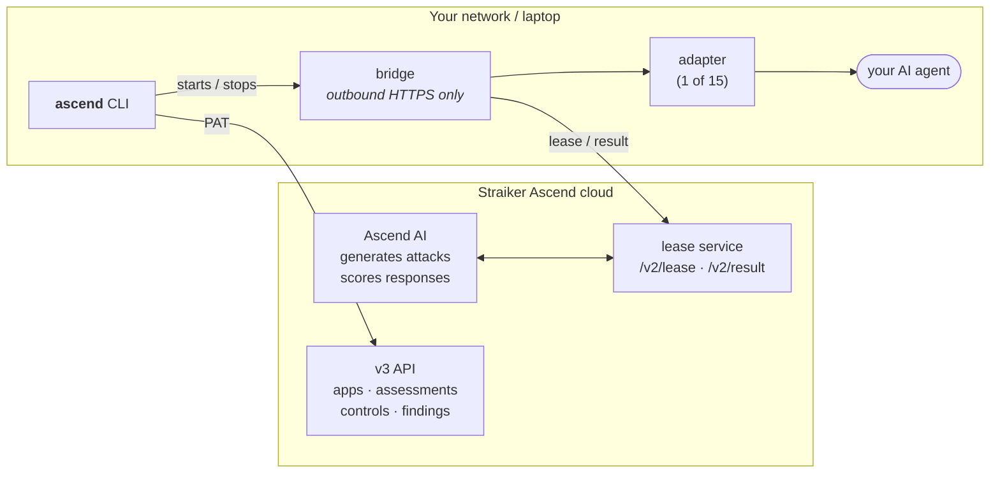
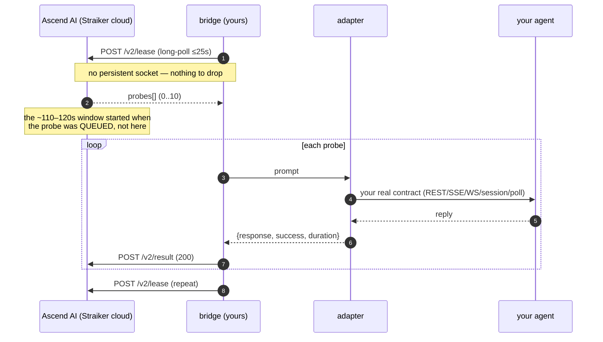
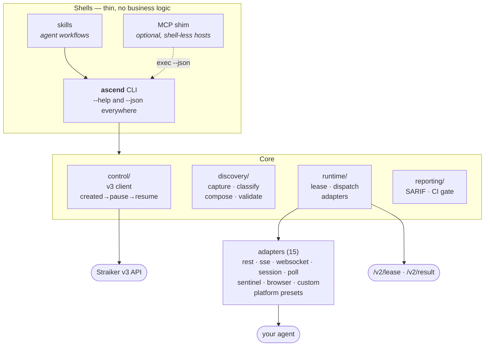
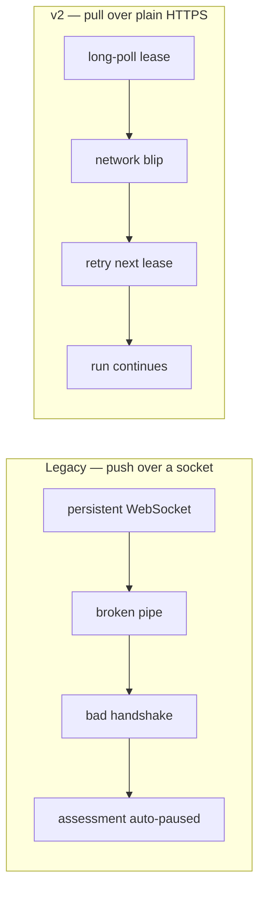
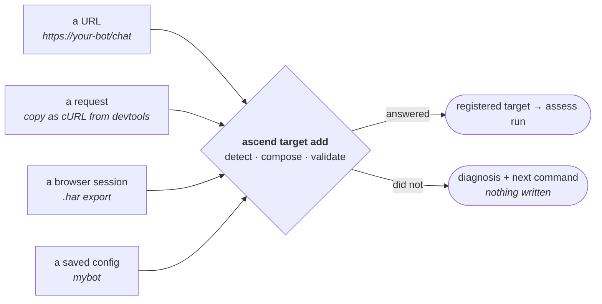

# Architecture

How Ascend CLI connects the Straiker Ascend assessment cloud to your AI agent —
what runs where, what data crosses which boundary, and what you have to operate.

> **Adapter reference:** the per-adapter configuration schemas live in
> [`ADAPTER_AUTHORING.md`](ADAPTER_AUTHORING.md) and the layer model in
> [`CAPABILITY_MATRIX.md`](CAPABILITY_MATRIX.md). For the product documentation on
> advanced adapters, see the Straiker documentation site
> (`https://docs.straiker.ai` → Ascend AI → advanced integrations).

---

## 1. The big picture

Straiker generates and scores the attacks. **You run a small bridge** that fetches
probes over plain HTTPS and delivers them to your agent however your agent expects to
be called. Your agent is never exposed to the internet, and Straiker never needs a
route into your network.

Two different things get called "the bridge" in conversation, and keeping them apart is
the difference between a five-minute diagnosis and an hour: the **lease service** is
Straiker-side and always up; **the bridge** is the process on your machine that leases
probes and calls your agent (this repo also calls it the relay). When someone says "the
bridge dropped", they nearly always mean their own bridge process is not running —
`ascend bridge ls` says which.

**Boundary facts that matter for review:**

| Question | Answer |
|---|---|
| Does Straiker connect *into* my network? | **No.** The bridge makes **outbound** HTTPS calls only. No inbound firewall rule, no public exposure of the agent. |
| What leaves my network? | The probe prompt (authored by Straiker) and your agent's response, which Straiker scores. |
| Where do my credentials live? | Target credentials stay in your adapter config / environment and are used only by the bridge. Straiker never receives them. |
| Can I stop it instantly? | Yes — stopping the bridge stops delivery immediately. |
| What if the bridge dies mid-probe? | The probe is reclaimed server-side after ~90s and redelivered. Nothing is lost. |
| How long may my agent take to answer? | Each probe has a bounded window of roughly **110–120s**, and the clock starts when the probe is **queued**, not when your relay calls the agent. See §6. |

---

## 2. The probe lifecycle

Failures are **submitted, never dropped** — a target error becomes an honest result, so
the assessment completes instead of hanging.

---

## 3. What you operate

One core, three thin shells. The CLI is the deterministic substrate; skills and the
optional MCP shim call it rather than reimplementing anything.

---

## 4. Why pull mode

The legacy bridge held a persistent WebSocket that Straiker pushed probes onto. A
dropped socket produced `bad handshake` on reconnect and could **auto-pause a live
assessment**. v2 inverts the flow.

There is no long-lived connection, so that entire class of failure cannot occur.
Un-acked probes are reclaimed after ~90s; the bridge adds a QPM throttle and
session-aware concurrency the old bridge lacked.

---

## 5. Getting connected

Most integration effort is *learning your agent's contract*. You supply whatever evidence
of that contract you already have, and `target add` works out which kind it is — choosing
between mutually-exclusive source flags was a question people frequently could not answer,
while the artifact itself always knows what it is.

A config is only usable once it has produced a real answer from your live target, so
`target add` validates before it registers anything, and `target check` re-proves a target
later. That second step is not ceremony: a target that has drifted — auth expired, response
shape moved, endpoint relocated — still yields a clean-*looking* assessment that measured
nothing, and a false pass is the most expensive outcome this tool can produce.

`adapter build`, `map` and `discover` remain available underneath for the cases that need
them. See [`DISCOVERY.md`](DISCOVERY.md) for the capture pipeline and its limits.

---

## 6. Two limits worth knowing before you debug

**The per-probe window.** The platform gives each probe roughly **110–120s**, measured from
when it is *queued* — not from when your relay calls your agent. A probe that exceeds it comes
back as a synthetic timeout that looks exactly like your target failing, and enough of those
auto-pause the assessment. So a slow agent presents as a broken one. `adapter validate` and
`target check` time the call and say so plainly when a target is at or beyond the window.
Agents that think for two or three minutes are common; if yours does, lower concurrency or
raise QPM headroom rather than assuming the relay is at fault.

**Where configs are found.** Adapter configs are searched per *file*, in this order:
`$ASCEND_CONFIG_DIR`, then `./configs`, then `~/.ascend/configs`, then the bundled examples.
New configs are written to one directory (`ascend adapter configs` prints which). This is
worth knowing because the failure is misleading: a config that cannot be resolved makes
`runtime start` exit *before it ever leases*, and a relay that never starts is
indistinguishable from one that dropped — while `ascend keys` keeps working, since keys live
in `~/.ascend` and never depended on the working directory.
